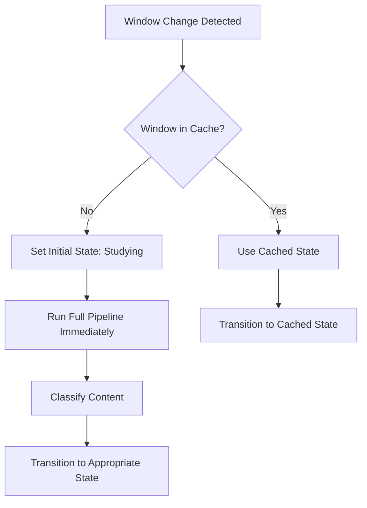
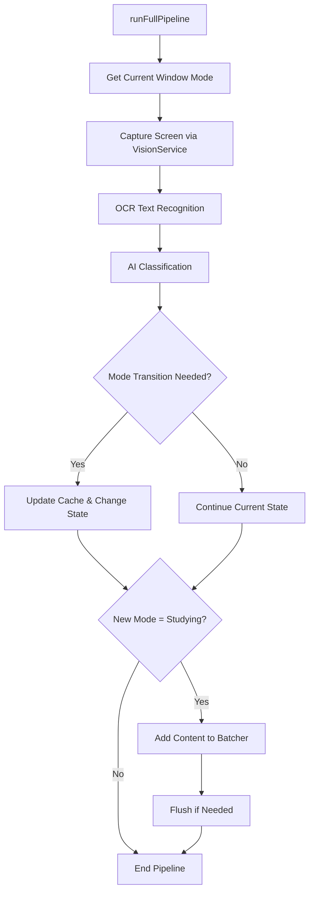

# Orchestrator Architecture Documentation

## Overview

The `Orchestrator` is the central coordination component that manages the application's behavior based on window activity and content classification. It implements the **State Design Pattern** to handle different operational modes and coordinates multiple polling systems for responsive user experience.

## Core Responsibilities

1. **State Management** - Transitions between Idle and Studying states
2. **Window Tracking** - Monitors active window changes
3. **Content Classification** - Orchestrates OCR and AI classification pipeline
4. **Polling Coordination** - Manages multiple polling systems with different intervals
5. **Cache Management** - Maintains window state and classification history

## State Design Pattern Implementation

### States Overview

The Orchestrator operates in two primary states:

- **IdleState**: User is not actively studying (e.g., browsing, in Discord)
- **StudyingState**: User is actively studying (e.g., reading documentation, coding)

### State Interface

```typescript
interface IOrchestratorState {
  onEnter(): void;
  onExit(): void;
  onWindowChange(oldWindow: string, newWindow: string): void;
  onTick(): void;
}
```

### State Implementations

#### IdleState
```typescript
class IdleState {
  onEnter() {
    // Start window change polling (1 second intervals)
    this.orchestrator.startWindowPolling();
    // Start idle revalidation polling (60 second intervals)
    this.orchestrator.startIdleRevalidationPolling();
  }
  
  onExit() {
    // Stop idle-specific polling
    this.orchestrator.stopIdleRevalidationPolling();
  }
}
```

**Responsibilities:**
- Monitor for window changes at high frequency (1s)
- Periodically revalidate idle windows (60s) to detect if user resumed studying
- Lightweight operation - minimal OCR/classification

#### StudyingState
```typescript
class StudyingState {
  onEnter() {
    // Start intensive OCR polling (30 second intervals)
    this.orchestrator.startStudyingOcrPolling();
  }
  
  onExit() {
    // Stop studying-specific polling
    this.orchestrator.stopStudyingOcrPolling();
  }
}
```

**Responsibilities:**
- Continuously capture and analyze screen content
- Feed study content to batch processing system
- Higher resource usage - frequent OCR and classification

## Polling Systems Architecture

The Orchestrator coordinates three independent polling systems:

### 1. Window Change Polling (Always Active)
- **Interval**: 1 second
- **Purpose**: Detect when user switches between applications/windows
- **Trigger**: Immediate classification for new windows, state transitions for known windows

### 2. Studying OCR Polling (Active in StudyingState)
- **Interval**: 30 seconds (configurable via `STUDYING_OCR_POLL_MS`)
- **Purpose**: Continuously analyze study content
- **Behavior**: Captures screen, classifies content, feeds to batcher

### 3. Idle Revalidation Polling (Active in IdleState)
- **Interval**: 60 seconds (configurable via `IDLE_REVALIDATION_INTERVAL_MS`)
- **Purpose**: Check if idle windows have become active study sessions
- **Threshold**: Only revalidates windows idle for >15 minutes

## Window Lifecycle Flow

### New Window Detection


### State Transition Logic
```typescript
// From transitionStateOnWindowChange()
if (entry.mode === "Studying") {
  desiredState = this.studyingState;
} else {
  desiredState = this.idleState;
}

if (this.state.constructor !== desiredState.constructor) {
  this.changeState(desiredState);
}
```

## Classification Pipeline

### Full Pipeline Flow


### Mode Transition Rules
- **Idle → Studying**: Content classified as study material
- **Studying → Idle**: Content classified as non-study material
- **No Transition**: Content matches current state

## Cache Management

### Cache Structure
```typescript
{
  [windowId: string]: {
    mode: "Studying" | "Idle",
    lastClassified: number  // timestamp
  }
}
```

### Cache Behaviors
- **TTL**: 15 minutes (configurable via `WINDOW_CACHE_TTL`)
- **Update Triggers**: 
  - Window changes (updates timestamp)
  - Classification results (updates mode + timestamp)
- **Cleanup**: Automatic via TTL system

## Key Methods Explained

### `onCommonWindowChange(oldKey, newKey)`
Central window change handler:
1. Updates timestamp for old window
2. Sets current window reference
3. For new windows: immediate classification
4. For known windows: state transition based on cache

### `runFullPipeline(windowId)`
Complete classification workflow:
1. Validates window exists in cache
2. Captures and classifies screen content
3. Handles state transitions
4. Processes study content if needed

### `IdleRevalidation()`
Periodic check for idle windows:
1. Validates current window exists
2. Checks if window has been idle too long
3. Re-runs classification if threshold exceeded

## Configuration Options

### Environment Variables
```bash
# Polling Intervals
WINDOW_POLL_MS=1000                    # Window change polling
STUDYING_OCR_POLL_MS=30000            # OCR polling in studying state
IDLE_REVALIDATION_INTERVAL_MS=60000   # Idle revalidation polling

# Thresholds
IDLE_REVALIDATION_THRESHOLD_MS=900000 # 15 min - when to revalidate idle windows
WINDOW_CACHE_TTL=900000               # 15 min - cache entry lifetime
```

### Performance Tuning
- **Responsive but resource-intensive**: Reduce OCR polling interval
- **Battery-friendly**: Increase all polling intervals
- **Memory conscious**: Reduce cache TTL

## Error Handling

### Pipeline Errors
- **VisionServiceError**: OCR/screen capture failures
- **ClassificationError**: AI classification failures  
- **CacheError**: Cache consistency issues

### Recovery Strategies
- Errors in polling callbacks are caught and logged
- Failed classifications don't break state transitions
- Cache misses trigger re-initialization

## Threading and Concurrency

### Async Considerations
- Window change handling is async (waits for classification)
- Polling callbacks are wrapped in Promise.resolve() for error handling
- State transitions are synchronous to prevent race conditions

### Race Condition Prevention
- currentWindow is updated before any async operations
- Cache updates are atomic
- State changes complete before new polling starts

## Debugging Tips

### Common Issues
1. **No pipeline logs**: Check if currentWindow is set correctly
2. **Missing state transitions**: Verify cache entries exist
3. **Polling not running**: Check if pollers are started in state.onEnter()

### Debug Logging
```typescript
// Add temporary logging
console.log(`Current window: ${this.currentWindow}`);
console.log(`Cache has window: ${this.cache.has(windowId)}`);
console.log(`Current state: ${this.state.constructor.name}`);
```

### Performance Monitoring
- Monitor polling intervals vs actual execution time
- Track cache hit/miss ratios
- Measure classification pipeline latency

## Architecture Benefits

### State Pattern Advantages
- **Clear separation** of concerns between operational modes
- **Easy extensibility** - new states can be added without modifying existing ones
- **Consistent behavior** - each state manages its own lifecycle

### Polling Coordination Benefits
- **Resource efficiency** - different polling rates for different activities
- **Responsiveness** - immediate reaction to window changes
- **Reliability** - independent polling systems reduce single points of failure

## Future Considerations

### Potential Enhancements
- **Adaptive polling** - adjust intervals based on user activity patterns
- **State persistence** - remember user preferences across sessions
- **Multi-display support** - handle multiple monitors independently
- **Focus-based classification** - different behavior for focused vs unfocused windows

### Scaling Considerations
- Current design handles single-user desktop usage
- For multi-user scenarios, would need session isolation
- For high-frequency usage, consider local caching of classification results